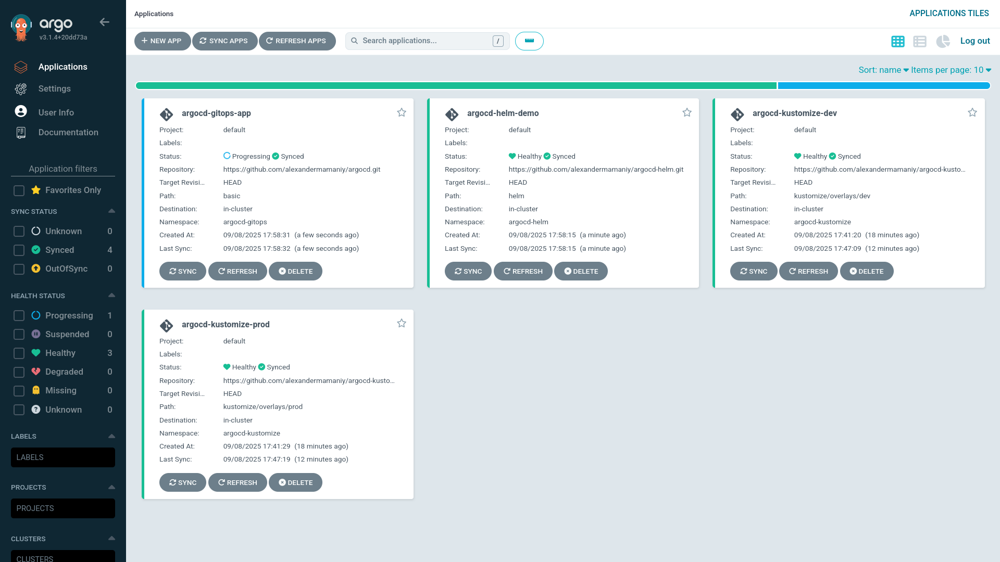

# CI/CD for Kubernetes

This project demonstrates a robust CI/CD pipeline for Kubernetes, leveraging GitHub Actions, GitHub Runners, and GitHub Container Registry. It integrates with ArgoCD, following GitOps principles to ensure a single source of truth for deployments.

## Features

- Automated build and push of Docker images to GitHub Container Registry.
- GitOps workflow: deployment manifests are updated automatically on new builds.
- Integration with ArgoCD for continuous delivery to Kubernetes clusters.
- Support for multiple Kubernetes implementations.

## Requirements

- **minikube**: v1.36.0
- **kubectl**:  
  - Client Version: v1.33.1  
  - Server Version: v1.33.1
- **Kustomize**: v5.6.0
- **Helm**: v3.18.6
- **GitHub Runner**: v2.328.0

## Personal Access Tokens

You need to generate the following GitHub Personal Access Tokens (PATs):

- `CR_PAT`:  
  _Scope: Push images to GitHub Container Registry_
- `GITOPS_PAT`:  
  _Scope: Push commits to specific repositories_

## GitOps Repositories

Container image tags and deployment manifests are managed in the following repositories, serving as the unique source of truth:

- [`argocd`](https://github.com/alexandermamaniy/app-api-gitops)
- [`argocd-helm`](https://github.com/alexandermamaniy/argocd-helm)
- [`argocd-kustomize`](https://github.com/alexandermamaniy/argocd-kustomize)

## How It Works

1. **Code Push or Pull Request:**  
   Triggers the GitHub Actions workflow.
2. **Build & Push:**  
   Docker image is built and pushed to GitHub Container Registry.
3. **Update:**  
   The deployment manifest in each repository is updated with the new image tag.
4. **ArgoCD Sync:**  
   ArgoCD detects the change and deploys the new version to each Kubernetes cluster.

## Getting Started

1. Fork and clone this repository.
2. Set up the required GitHub PATs as repository secrets: `CR_PAT` and `GITOPS_PAT`.
3. Configure your self-hosted GitHub Runner.
4. Ensure your Kubernetes cluster is running and accessible.

## ArgoCD Overview
